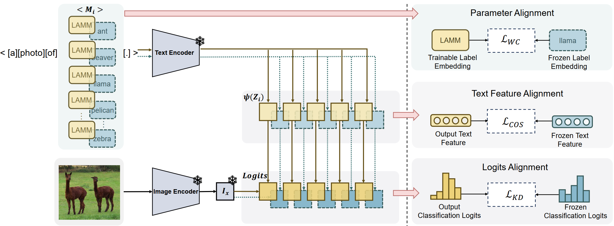
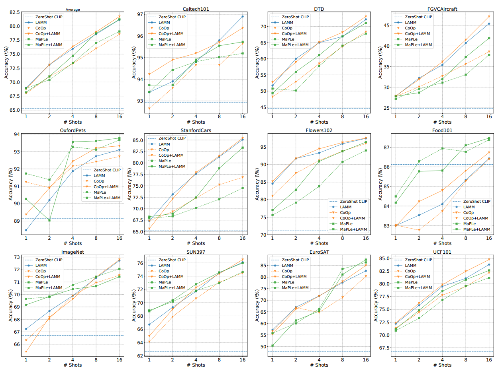

# LAMM: Label Alignment for Multi-Modal Prompt Learning [AAAI 2024]

Official implementation of the paper "LAMM: Label Alignment for Multi-Modal Prompt Learning".

## Highlights

> **<p align="justify">  Abstract:** *With the success of pre-trained visual-language (VL) models such as CLIP in visual representation tasks, transferring pre-trained models to downstream tasks has become a crucial paradigm. Recently, the prompt tuning paradigm, which draws inspiration from natural language processing (NLP), has made significant progress in VL field. However, preceding methods mainly focus on constructing prompt templates for text and visual inputs, neglecting the gap in class label representations between the VL models and downstream tasks. To address this challenge, we introduce an innovative label alignment method named \textbf{LAMM}, which can dynamically adjust the category embeddings of downstream datasets through end-to-end training. Moreover, to achieve a more appropriate label distribution, we propose a hierarchical loss, encompassing the alignment of the parameter space, feature space, and logits space. We conduct experiments on 11 downstream vision datasets and demonstrate that our method significantly improves the performance of existing multi-modal prompt learning models in few-shot scenarios, exhibiting an average accuracy improvement of 2.31(\%) compared to the state-of-the-art methods on 16 shots. Moreover, our methodology exhibits the preeminence in continual learning compared to other prompt tuning methods. Importantly, our method is synergistic with existing prompt tuning methods and can boost the performance on top of them.* </p>

## MainResults


## Installation 
For installation and other package requirements, please follow the instructions detailed in [INSTALL.md](docs/INSTALL.md). 

## Data preparation
Please follow the instructions at [DATASETS.md](docs/DATASETS.md) to prepare all datasets.

## Training and Evaluation
Please follow the instructions at [RUN.md](docs/RUN.md) to run LAMM, CoOp+LAMM and MaPLe+LAMM.

## Citation
If you use our work, please consider citing:
```bibtex
@article{gao2023lamm,
  title={LAMM: Label Alignment for Multi-Modal Prompt Learning},
  author={Gao, Jingsheng and Ruan, Jiacheng and Xiang, Suncheng and Yu, Zefang and Ji, Ke and Xie, Mingye and Liu, Ting and Fu, Yuzhuo},
  journal={arXiv preprint arXiv:2312.08212},
  year={2023}
}
```

## Contact
If you have any questions, please create an issue on this repository or contact at gaojingsheng@sjtu.edu.cn.

## Acknowledgements

Our code is based on [MaPLe](https://github.com/muzairkhattak/multimodal-prompt-learning) and [CoOp](https://github.com/KaiyangZhou/CoOp) repository. We thank the authors for releasing their code. If you use our model and code, please consider citing these works as well.
